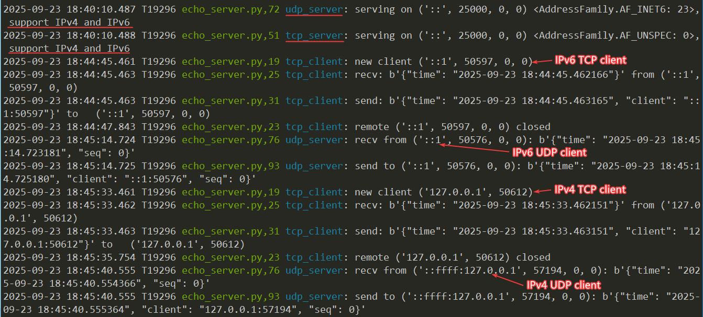

# aio-sockets

💡 Overview

aio-sockets is a lightweight and user-friendly library that provides a simplified, higher-level API for handling asynchronous TCP and UDP network communication in Python. Built on top of the powerful asyncio library, this wrapper abstracts away common complexities, allowing developers to focus on their application logic rather than low-level socket management.

This library is perfect for building high-performance, concurrent network applications like servers, clients, and P2P tools with minimal boilerplate code.

✨ Features

Simplified API: Easy-to-use classes like TCPSocket and UDPSocket encapsulate common operations like sending, receiving, and closing connections.

Context Manager Support: Use async with for both TCP and UDP sockets to ensure resources are automatically and correctly closed, preventing leaks.

Read-with-Timeout: Built-in recv_timeout and recvfrom_timeout methods make it simple to handle non-blocking reads with a defined timeout, preventing your application from hanging.

📦 Installation

This is a single-file library.<br>
1, Simply copy the aio_sockets.py file into your project directory.<br>
2, Or run `pip install aio-sockets`.

Minimum supported version: Python 3.8

## Usage

### Basic TCP Server Example

```python
import socket
import aio_sockets as aio
log = print

async def tcp_client(sock: aio.TCPSocket):
    raddr: aio.IPAddress = sock.getpeername()
    log(f'new client {raddr} connected')
    async with sock:
        while True:
            data = await sock.recv()
            if not data:
                log(f'remote {raddr} close connection')
                break
            log(f'recv: {data} from {raddr}')
            log(f'send: {data} to {raddr}')
            await sock.send(data)

async def tcp_server(host: str, port: int, family:socket.AddressFamily = socket.AF_INET):
    async with await aio.start_tcp_server(tcp_client, host, port, family=family) as server:
        sock: aio.trsock.TransportSocket = server.sockets[0]
        log(f'serving on {sock.getsockname()} {family!r}')
        await server.serve_forever()

aio.run(tcp_server('0.0.0.0', 25000)) # aio.run is just asyncio.run
```

### Basic TCP Client Example

```python
import socket
import aio_sockets as aio
log = print

async def tcp_client(server_ip: str, server_port: int, timeout: int = 5,
                     family:socket.AddressFamily = socket.AF_INET):
    log(f'connect to {server_ip}:{server_port}')
    sock: aio.TCPSocket = await aio.open_tcp_connection(server_ip, server_port, family=family)
    laddr, raddr = sock.getsockname(), sock.getpeername()
    log(f'connected, local address={laddr}')
    async with sock:
        for i in range(3):
            data = f'Hi {i}'.encode()
            log(f'{laddr} send to {raddr}: {data}')
            await sock.send(data)
            # data = await sock.recv()
            try:
                data = await sock.recv_timeout(n=8192, timeout=timeout)
                log(f'{laddr} recv: {data}')
                if not data:
                    log(f'server closed connection {laddr}')
                    break
            except TimeoutError as ex:
                log(f'{laddr} recv timeout, ex={ex!r}')

aio.run(tcp_client('127.0.0.1', 25000))
```

### Basic UDP Server Example

```python
import socket
import aio_sockets as aio
log = print

async def udp_server(host: str, port: int, family:socket.AddressFamily = socket.AF_INET):
    sock: aio.UDPSocket = await aio.create_udp_socket(local_addr=(host, port), family=family)
    log(f'serving on {sock.getsockname()} {family!r}')
    async with sock:
        while True:
            data, raddr = await sock.recvfrom()
            log(f'recv from {raddr}: {data}')
            log(f'send to {raddr}: {data}')
            sock.sendto(data, raddr)

aio.run(udp_server('0.0.0.0', 25000))
```

### Basic UDP Client Example

```python
import socket
import aio_sockets as aio
log = print

async def udp_client(server_ip: str, server_port: int, family:socket.AddressFamily = socket.AF_INET):
    sock: aio.UDPSocket
    async with await aio.create_udp_socket(remote_addr=(server_ip, server_port), family=family) as sock:
        laddr, raddr = sock.getsockname(), sock.getpeername()

        async def udp_recv_loop():
            while True:
                data, raddr = await sock.recvfrom()
                log(f'{laddr} recv from {raddr}: {data}')
                if not data:
                    break

        aio.create_task(udp_recv_loop())

        for i in range(3):
            data = f'Hi {i}'.encode()
            log(f'{laddr} send to {raddr}: {data}')
            sock.sendto(data, None)

        await aio.sleep(1) # wait and make udp_recv_loop have time to receive

async def start_udp_client():
    await udp_client('127.0.0.1', 25000)
    await aio.wait_all_tasks_done() # wait for udp_recv_loop to finish

aio.run(start_udp_client())
```

### Running the Examples

To test the examples above, you can use the provided `echo_server.py` and `echo_client.py` files.

```shell
# Start the echo server, supports both TCP and UDP
python echo_server.py -p 25000                  # supports IPv4 and IPv6
python echo_server.py --host :: -p 25000        # only IPv6
python echo_server.py --host 0.0.0.0 -p 25000   # only IPv4

# Run IPv4 TCP client
python echo_client.py -s 127.0.0.1 -p 25000

# Run IPv4 UDP client
python echo_client.py -s 127.0.0.1 -p 25000 -u

# Run IPv6 TCP client
python echo_client.py -s ::1 -p 25000

# Run IPv6 UDP client
python echo_client.py -s ::1 -p 25000 -u
```

Echo Server Snapshot:

